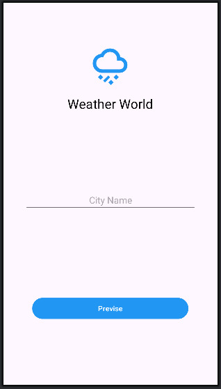

# WeatherWorld – App de Consulta de Clima

WeatherWorld é um aplicativo Android desenvolvido em Kotlin que consome a API **OpenWeatherMap** para exibir informações de clima em tempo real, incluindo:

* Nome da cidade
* Temperatura atual, mínima e máxima
* Condição climática
* Umidade
* Velocidade do vento
* Sensação térmica


## Funcionalidades

* Busca automática de clima por cidade
* Exibição organizada dos dados retornados pela API
* Botão de **voltar** funcional com `ImageView`


## Tecnologias Utilizadas

* **Kotlin**
* **Android XML Layout**
* **ViewBinding / findViewById**
* **Retrofit** para requisições HTTP
* **Gson** para conversão JSON → Kotlin
* **ConstraintLayout**


## Consumo da API

Exemplo de chamada à API:

Url para o `GET` : https://api.openweathermap.org/data/2.5/weather?q=saara&appid=API_KEY

```JSON
{
    "coord": {
        "lon": 12.4167,
        "lat": 50.9333
    },
    "weather": [
        {
            "id": 601,
            "main": "Snow",
            "description": "snow",
            "icon": "13d"
        }
    ],
    "base": "stations",
    "main": {
        "temp": 274.27,
        "feels_like": 270.92,
        "temp_min": 272.88,
        "temp_max": 274.4,
        "pressure": 1014,
        "humidity": 95,
        "sea_level": 1014,
        "grnd_level": 986
    },
    "visibility": 10000,
    "wind": {
        "speed": 3.09,
        "deg": 180
    },
    "snow": {
        "1h": 0.64
    },
    "clouds": {
        "all": 100
    },
    "dt": 1768224622,
    "sys": {
        "type": 2,
        "id": 2026436,
        "country": "DE",
        "sunrise": 1768201744,
        "sunset": 1768231657
    },
    "timezone": 3600,
    "id": 2842656,
    "name": "Saara",
    "cod": 200
}
```


<p float="left">
  
  
</p>

<!-- ## Estrutura do Projeto

```
app/
 └── java/com.example.weatherworld/
      ├── model/
      │    └── WeatherEntity.kt
      ├── network/
      │    └── RetrofitInstance.kt
      ├── ui/
      │    ├── MainActivity.kt
      │    └── DetailActivity.kt
      └── adapter/ (se houver listas)
``` -->


## Como executar

1. Clonar o repositório:

```bash
git clone https://github.com/elder-storck/Disciplina-Desenvolvimento-Mobile.git
```
2. Abrir no Android Studio
3. Adicionar sua chave da API no código da tela descritiva
4. Rodar no emulador ou celular