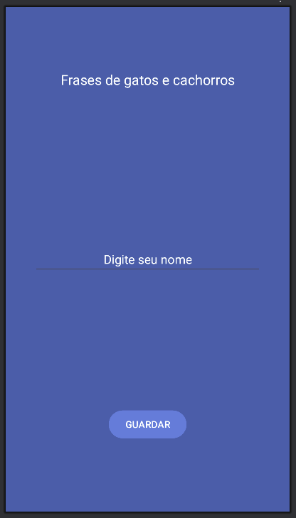
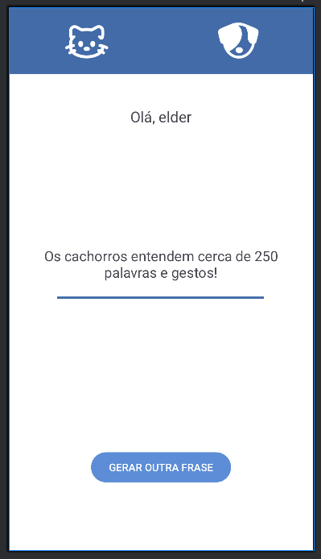

# Animal Facts App

Um aplicativo Android educativo que exibe curiosidades sobre cães e gatos. Desenvolvido em Kotlin com arquitetura moderna.

## Sobre o Projeto

O Animal Facts é um aplicativo interativo que permite aos usuários:
- Inserir seu nome para personalização
- Visualizar curiosidades aleatórias sobre cães e gatos
- Alternar entre os dois animais com interface intuitiva
- Gerar novas curiosidades com um toque

## Tecnologias Utilizadas

- **Linguagem:** Kotlin
- **Arquitetura:** MVVM (Model-View-ViewModel)
- **UI:** XML com ViewBinding
- **Persistência:** SharedPreferences
- **Padrões:** Repository Pattern, ViewModel

## Funcionalidades

### Tela Principal (MainActivity)
- ✅ Campo de entrada para nome do usuário
- ✅ Validação de entrada
- ✅ Persistência de dados do usuário
- ✅ Navegação para tela de curiosidades

### Tela de Curiosidades (FactsActivity)
- ✅ Exibição de boas-vindas personalizada
- ✅ Seleção entre cães e gatos
- ✅ Geração de curiosidades aleatórias
- ✅ Interface visual com indicador de seleção
- ✅ Botão para nova curiosidade

## Capturas de Tela

### Tela de Boas-Vindas


**Características:**
- Design limpo com fundo azul
- Campo centralizado para inserir nome
- Botão de ação destacado
- Interface intuitiva e moderna

### Tela de Curiosidades


**Características:**
- Barra superior com ícones interativos
- Área central para exibição de curiosidades
- Seleção visual entre cão e gato
- Botão para gerar nova curiosidade
- Layout responsivo e atraente

## Estrutura do Projeto

```
app/
├── src/main/
│   ├── java/com/example/aula10_curiosidadesanimais/
│   │   ├── MainActivity.kt          # Tela de boas-vindas
│   │   ├── FactsActivity.kt         # Tela de curiosidades
│   │   ├── AnimalViewModel.kt       # Lógica de negócio
│   │   ├── MyPreferences.kt         # Gerenciamento de preferências
│   │   └── ...
│   ├── res/
│   │   ├── layout/
│   │   │   ├── activity_main.xml    # Layout tela principal
│   │   │   └── activity_facts.xml   # Layout tela curiosidades
│   │   ├── values/
│   │   │   ├── strings.xml          # Recursos de texto
│   │   │   ├── colors.xml           # Paleta de cores
│   │   │   └── arrays.xml           # Curiosidades
│   │   └── drawable/                # Ícones e imagens
└── └── ...
```

## Design

### Cores Principais
- **Azul Primário:** `#426BA8`
- **Azul Secundário:** `#5c8dd6` 
- **Laranja de Destaque:** `#FFC107`
- **Branco:** `#FFFFFFFF`
- **Preto:** `#FF000000`


## Principais Arquivos

### AnimalViewModel.kt
Gerencia as curiosidades e a lógica de negócio:
```kotlin
class AnimalViewModel : ViewModel() {
    fun getDogFact(): String
    fun getCatFact(): String
}
```

### MyPreferences.kt
Gerencia o armazenamento local:
```kotlin
class MyPreferences(context: Context) {
    fun setString(key: String, value: String)
    fun getString(key: String): String
}
```


## Autor

Desenvolvido por Elder R. Storck
